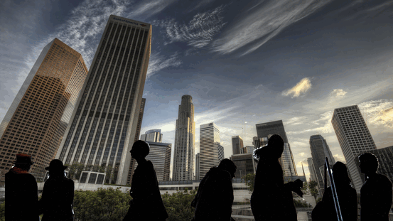

# Auto-Inpaint-Anything-WebAPP
This WebApp is an open-source project aimed at automizing the process of Inpainting Images and videos giving the same quality as [Inpaint-Anything](https://github.com/geekyutao/Inpaint-Anything). The reason I created this app is because let's say you need to remove 1000 objects from a galary using LaMa, if we try to do that using Inpaint ANything we will have to stop at every image and choose the objects point coordinates with cursor, which will make this process really hard. However, if we add an object detection layer at the beggining we can get point coordinates automatically with out any human interaction, you only need to specify the object's name and [GroundingDino](https://huggingface.co/docs/transformers/en/model_doc/grounding-dino) will detect it.


It was inspired by [Inpaint-Anything](https://github.com/geekyutao/Inpaint-Anything). 


Unlike Inpaint Anything, it differs in:
1. I added an Object detection layer at the beggining of the inference Pipeline, you just need to specify the wanted object in a prompt, with out choosing from cursor.
2. You can use the endpoints independently after using the dio_sam endpoint. Example: Use the dino_sam endpoint to get the segment objects first then if you use the fill_anything endpoint it will automatically get the segmented result and do the changes you asked for in the fill_prompt.
3. If you integrate the API's correctly, you can automize the process of doing Inpainting without human interaction using cursor to define the point coords


### Here is a simple example of removing unwanted objects in an image:



## This web APP has 4 endpoints:
1. **http://localhost:5004/app/demo/dino_sam:** This part is powered using [GroundingDino](https://huggingface.co/docs/transformers/en/model_doc/grounding-dino) for object detection and [SAM](https://github.com/facebookresearch/segment-anything) for segmentation, this part is the most essential part to run the other endpoints. Before running anyt other endpoint start by request.post to dino_sam. Any request to other endpoint will use the responsed data from the last request to dino_sam.

2. **http://localhost:5004/app/demo/remove_anything:** This part is powered using [LaMa](https://github.com/advimman/lama), 
3. **http://localhost:5004/app/demo/replace_anything:**
4. **http://localhost:5004/app/demo/fill_anything:**


## The front_end is only to showcase the results and shows you how to integrate the API's


## simple demo with [gradio](https://github.com/gradio-app/gradio)

## Environment setup
A minimum of 12 gb memory gpu is required.
1. Download pre-trained weights [MaskDINO](https://github.com/IDEA-Research/detrex-storage/releases/download/maskdino-v0.1.0/maskdino_swinl_50ep_300q_hid2048_3sd1_instance_maskenhanced_mask52.3ap_box59.0ap.pth) and [LaMa](https://disk.yandex.ru/d/ouP6l8VJ0HpMZg) 
1. Put the directory like this
```
├── app
│   ├── ai_services
│   │   ├── get_fill_anything_result.py
│   │   ├── get_remove_anything_result.py
│   │   ├── get_replace_anything_result.py
│   │   ├── get_segmented_image.py
│   ├── routes
│   │   ├── dino_sam.py
│   │   ├── fill_anything.py
│   │   ├── remove_anything.py
│   │   ├── replace_anything.py
│   ├── schemas
│   │   ├── response_bodies.py
├── config.py
├── front_end.py
├── gdino_sam
│   ├── get_point_coords.py
│   ├── get_segmentation_masks.py
│   ├── __init__.py
├──inpaint_anything
├── images
│   ├── demo.gif
├── main.py
├── requirements.txt
├── README.md
├── .gitignore
├── LICENSE
├── __init__.py
```

3. conda environment setup
```
conda create --name maskdino python=3.8 -y
conda activate maskdino
conda install pytorch==1.9.0 torchvision==0.10.0 cudatoolkit=11.1 -c pytorch -c nvidia
pip install -U opencv-python

mkdir repo
git clone git@github.com:facebookresearch/detectron2.git
cd detectron2
pip install -e .
pip install git+https://github.com/cocodataset/panopticapi.git

cd ..
git clone -b quickfix/infer_demo --single-branch https://github.com/MeAmarP/MaskDINO.git
cd MaskDINO
pip install -r requirements.txt
cd maskdino/modeling/pixel_decoder/ops
python setup.py build install
cd ../../../../..

git clone https://github.com/geomagical/lama-with-refiner.git
cd lama-with-refiner
pip install -r requirements.txt 
pip install --upgrade numpy==1.23.0
cd ../..
pip install gradio
```
4. Run
``` bash
#localhost http://127.0.0.1:7860
python demo.py
```
## Acknowledgments
Many thanks to these excellent opensource projects
* [LaMA](https://github.com/saic-mdal/lama)
* [LaMa with refiner](https://github.com/geomagical/lama-with-refiner)
* [MaskDINO](https://github.com/IDEA-Research/MaskDINO)
* [MaskDINO inference code](https://github.com/MeAmarP/MaskDINO/tree/quickfix/infer_demo)
* [Detectron2](https://github.com/facebookresearch/detectron2)
* [Auto-Lama](https://github.com/andy971022/auto-lama)
