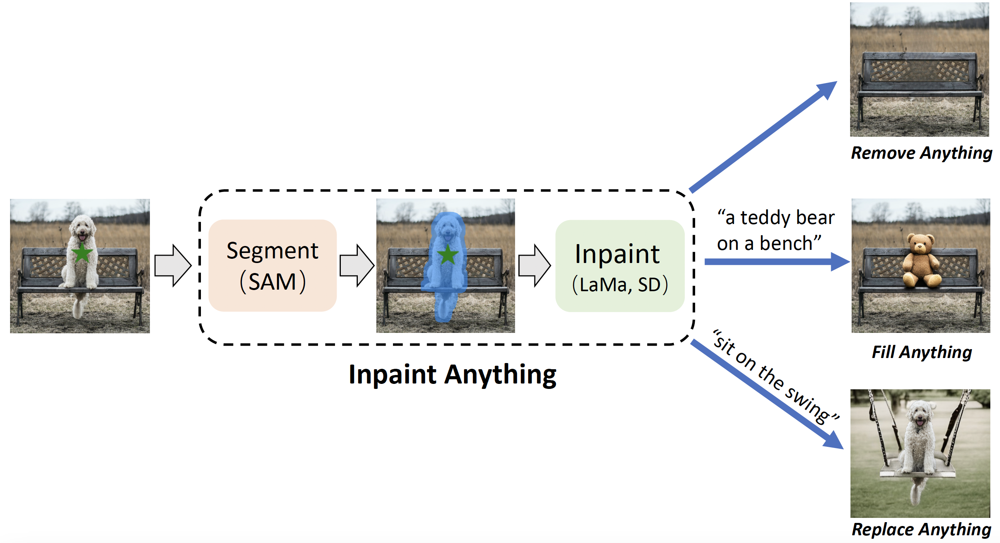
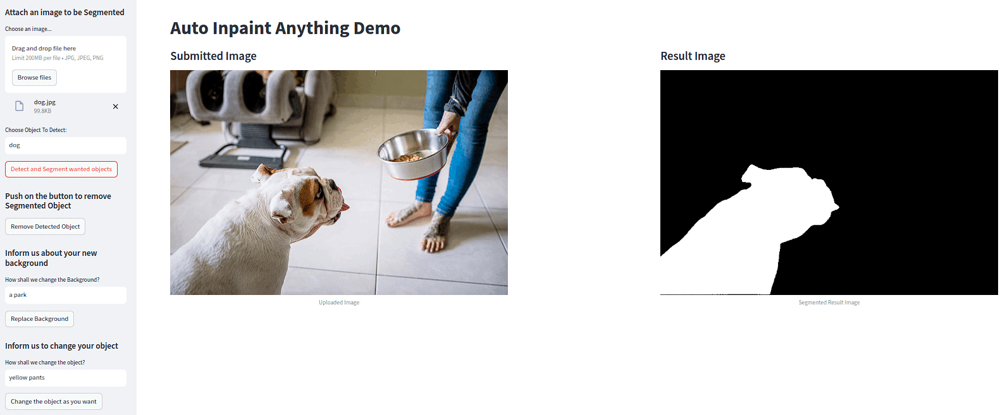
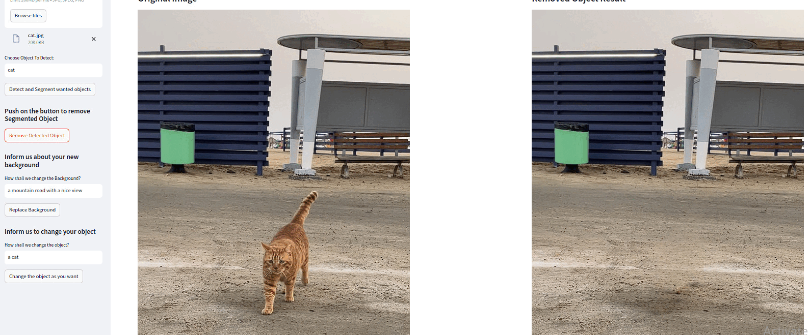
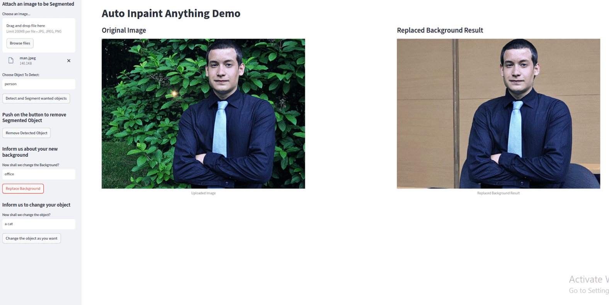
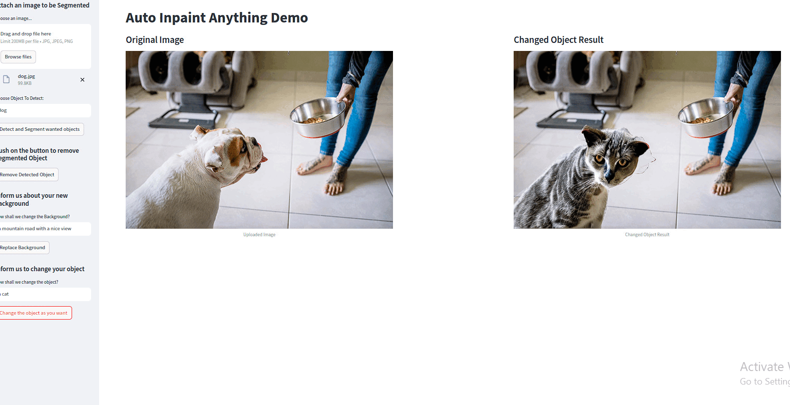

# Auto-Inpaint-Anything-WebAPP
This WebApp is an open-source project aimed at automizing the process of Inpainting Images and videos giving the same quality as [Inpaint-Anything](https://github.com/geekyutao/Inpaint-Anything). The reason I created this app is because let's say you need to remove 1000 objects from a galary using LaMa, if we try to do that using Inpaint Anything we will have to stop at every image and choose the objects point coordinates with cursor, which will make this process really hard. However, if we add an object detection layer at the beggining we can get point coordinates automatically with out any human interaction, you only need to specify the object's name and [GroundingDino](https://huggingface.co/docs/transformers/en/model_doc/grounding-dino) will detect it.




**It was inspired by [Inpaint-Anything](https://github.com/geekyutao/Inpaint-Anything). Unlike Inpaint Anything, it differs in:**
1. I added an Object detection layer at the beggining of the inference Pipeline, you just need to specify the wanted object in a prompt, with out choosing from cursor.
2. I integrated the provided Inpaint-Anything functionality into an API with 4 different endpoints to be used independently after using the dino_sam endpoint. Example: Use the dino_sam endpoint to get the segment objects first then if you use the fill_anything endpoint it will automatically get the segmented result and do the changes you asked for in the fill_prompt.
3. If you integrate the API's correctly, you can automize the process of doing Inpainting without human interaction for thousands of different images.


### This web APP has 4 endpoints:
1.**http://localhost:5004/app/demo/dino_sam:** This part is powered using [GroundingDino](https://huggingface.co/docs/transformers/en/model_doc/grounding-dino) for object detection and [SAM](https://github.com/facebookresearch/segment-anything) for segmentation, this part is the most essential part to run the other endpoints. Before running anyt other endpoint start by request.post to dino_sam. Any request to other endpoint will use the responsed data from the last request to dino_sam.

<br>

**Here is some examples obtained while testing the results:**
First you need to attach your image that you want to segment, and write the name of the object you want to segment, then push the Detect and Segment objects button:


<br>

2.**http://localhost:5004/app/demo/remove_anything:** This part is powered using [LaMa](https://github.com/advimman/lama), it takes the segmented part and removes it from the images using Inpainting with Fourier Convolutions. Make sure to keep the value of dilation on the segmented image as 15, if you want to you can change the value from the config file. 

<br>

**Here is some examples obtained while testing the results:**


<br>

3.**http://localhost:5004/app/demo/replace_anything:** This part is powered using the [stabilityai/stable-diffusion-2-inpainting](https://huggingface.co/stabilityai/stable-diffusion-2-inpainting), make sure to not dilate the segmented image to get the best result, this part keep the segmented object and changes the background depending on the given prompt.

<br>

**Here is some examples obtained while testing the results:** Fill the prompt and Push the Replace Background button



4.**http://localhost:5004/app/demo/fill_anything:** This part is powered using the [stabilityai/stable-diffusion-2-inpainting](https://huggingface.co/stabilityai/stable-diffusion-2-inpainting), it changes the segmented part depending on waht you ask for in your prompt. Make sure to keep the value of dilation on the segmented image as 50 to get best reults, if you want to you can change the value from the config file. 

**Here is some examples obtained while testing the results:** Fill the prompt and Push the Change the object as you want button



**The front_end is only to showcase the results and shows you how to integrate the API's.**


## Developer Guide for environment setup
A minimum of 12 gb memory gpu is required. I used Nvidia RTX 3060 in the development and test process.


### Step 1: Clone the Repository

First, clone the repository to your local machine using the command:

```bash
git clone https://github.com/Abdulkadir19997/Auto-Inpaint-Anything-WebAPP.git
```

**Keep the project archtiecture the same:**
```
├── app
│   ├── ai_services
│   │   ├── get_fill_anything_result.py
│   │   ├── get_remove_anything_result.py
│   │   ├── get_replace_anything_result.py
│   │   ├── get_segmented_image.py
│   ├── routes
│   │   ├── dino_sam.py
│   │   ├── fill_anything.py
│   │   ├── remove_anything.py
│   │   ├── replace_anything.py
│   ├── schemas
│   │   ├── response_bodies.py
├── config.py
├── front_end.py
├── gdino_sam
│   ├── get_point_coords.py
│   ├── get_segmentation_masks.py
│   ├── __init__.py
├──inpaint_anything
├── images
│   ├── demo.gif
├── main.py
├── requirements.txt
├── README.md
├── .gitignore
├── LICENSE
├── __init__.py
```

### Step 2: Create Python Environment

Inside the downloaded 'Automated-Inpaint-Anything' folder, create a Python environment, **I used 3.10.12 version of python**. For example, to create an environment named 'auto_inpainter', use:

```bash
python -m venv auto_inpainter
```

### Step 3: Activate Environment

Activate the environment with:

```bash
.\auto_inpainter\Scripts\activate
```

### Step 4: Install Requirements

After confirming that the auto_inpainter environment is active, install all necessary libraries from the 'requirements.txt' file:

```bash
pip install -r requirements.txt
```

### Step 5: Download the checkpoint models from the drive link
Download the model checkpoints:
1. Download the SAM sam_vit_h_4b8939.pth and the big-lama models from the given drive [pretrained_models](https://drive.google.com/drive/folders/1wpY-upCo4GIW4wVPnlMh_ym779lLIG2A?usp=sharing) 
2. Put both of them into `inpaint_anything/pretrained_models` folder (remember to extract the downloaded big-lama.zip file).


### Step 6: Run the Streamlit Application

In the active 'auto_inpainter' environment, run the 'front_end.py' file with:

```bash
streamlit run front_end.py
```

### Step 7: Open a New Terminal Session

Open a new terminal inside the 'AI-Job-Finder' folder and activate the 'auto_inpainter' environment again:

```bash
.\auto_inpainter\Scripts\activate
```

### Step 8: Run FastAPI

In the second terminal with the 'auto_inpainter' environment active, start the FastAPI service with:

```bash
uvicorn main:app --reload
```

### Step 9: Start the Application

Fill in the required fields and hit the start button to gather all the job listings for the specified job title and location, sorted by match scores against your uploaded CV.


### Step 10: Try the API's using front_end 

Jobs are listed from highest to lowest match scores. Apply to the job of interest by clicking on the "apply" button.


## Notes
To run locally, operate two different terminals each time: one with the 'auto_inpainter' environment to run 'streamlit run front_end.py', and another to execute 'uvicorn main:app --reload'.

## Acknowledgments
Many thanks to these excellent opensource projects
* [LaMA](https://github.com/saic-mdal/lama)
* [GroundingDino](https://huggingface.co/docs/transformers/en/model_doc/grounding-dino))
* [SAM](https://github.com/facebookresearch/segment-anything)
* [Inpaint-Anything](https://github.com/geekyutao/Inpaint-Anything)

## Version
The current version is 1.0. Development is ongoing, and any support or suggestions are welcome. Please reach out to me:
Abdulkadermousabasha7@gmail.com & LinkedIn